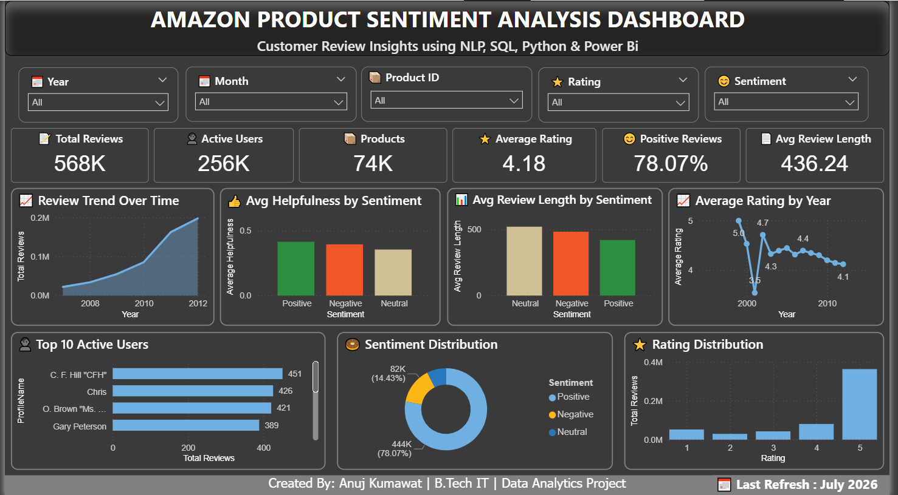

🛒 Amazon Product Sentiment Analysis Dashboard

A complete end-to-end **Data Analytics & Machine Learning** project that analyzes Amazon product reviews using **Natural Language Processing (NLP)**, **SQL**, **Python**, and **Power BI**.

The project transforms raw customer reviews into actionable business insights through data cleaning, sentiment analysis, SQL business queries, interactive dashboards, and machine learning.

---

## 📌 Project Overview

This project aims to:

- Analyze customer reviews from Amazon products.
- Classify reviews into Positive, Neutral, and Negative sentiments.
- Perform Exploratory Data Analysis (EDA).
- Generate business insights using SQL.
- Build an interactive Power BI dashboard.
- Train a Machine Learning model for sentiment prediction.

---

## 🚀 Tech Stack

- Python
- Pandas
- NumPy
- Matplotlib
- Seaborn
- Scikit-learn
- NLTK
- TF-IDF Vectorizer
- Support Vector Machine (SVM)
- MySQL
- Power BI
- Jupyter Notebook
- Git & GitHub

---

## 📂 Project Structure

```
Amazon-Product-Sentiment-Analysis/
│
├── data/
│   └── sample_reviews.csv
│
├── notebooks/
│   ├── 01_Data_Cleaning.ipynb
│   ├── 02_Exploratory_Data_Analysis.ipynb
│   ├── 03_NLP_Preprocessing.ipynb
│   └── 04_Sentiment_Classification.ipynb
│
├── sql/
│   └── business_queries.sql
│
├── powerbi/
│   └── Amazon_Product_Sentiment_Dashboard.pbix
│
├── models/
│   ├── sentiment_model.pkl
│   └── tfidf_vectorizer.pkl
│
├── images/
│   └── dashboard_dark.png
│
├── README.md
└── LICENSE
```

---

## 📊 Dataset

The dataset contains Amazon product reviews.

### Main Columns

- ProductId
- UserId
- Rating
- Review
- Review_Summary
- Sentiment
- Review_Length
- HelpfulnessNumerator
- HelpfulnessDenominator
- Helpfulness_Ratio
- Year
- Month

> **Note:** A sample dataset is included in this repository. The original dataset is significantly larger.

---

## 📈 Exploratory Data Analysis

Performed analysis including:

- Missing Value Analysis
- Duplicate Record Detection
- Rating Distribution
- Sentiment Distribution
- Review Length Analysis
- Correlation Analysis
- Time-Based Trend Analysis

---

## 🤖 NLP Preprocessing

The text preprocessing pipeline includes:

- Lowercase Conversion
- Removing HTML Tags
- Removing Punctuation
- Removing Numbers
- Tokenization
- Stopword Removal
- Stemming/Lemmatization
- TF-IDF Vectorization

---

## 🧠 Machine Learning

Model Used:

- Support Vector Machine (SVM)

### Workflow

- Train-Test Split
- TF-IDF Feature Extraction
- Model Training
- Prediction
- Model Evaluation
- Model Saving using Joblib

---

## 📊 Power BI Dashboard

The interactive dashboard includes:

### KPI Cards

- Total Reviews
- Active Users
- Total Products
- Average Rating
- Positive Review %
- Average Review Length

### Interactive Filters

- Year
- Month
- Product ID
- Rating
- Sentiment

### Visualizations

- Review Trend Over Time
- Rating Distribution
- Sentiment Distribution
- Average Rating by Year
- Average Review Length by Sentiment
- Average Helpfulness by Sentiment
- Top Active Users

---

## 🗄 SQL Analysis

The SQL file contains business queries covering:

- Basic SQL Queries
- Aggregate Functions
- GROUP BY & HAVING
- Subqueries
- CASE Statements
- Common Table Expressions (CTEs)
- Window Functions
- Ranking Functions
- Business Insight Queries

---

## 📌 Business Insights

- Most customer reviews are Positive.
- Average rating is approximately 4.18.
- Rating 5 has the highest number of reviews.
- Positive reviews have the highest overall share.
- Review activity changes significantly over time.
- Helpfulness varies across different sentiments.

---

## 📷 Dashboard Preview



---

## ▶️ How to Run

### 1. Clone the Repository

```bash
git clone https://github.com/yourusername/Amazon-Product-Sentiment-Analysis.git
```

### 2. Install Dependencies

```bash
pip install -r requirements.txt
```

### 3. Open Jupyter Notebook

Run notebooks in this order:

1. Data Cleaning
2. Exploratory Data Analysis
3. NLP Preprocessing
4. Sentiment Classification

### 4. Open Power BI

Open:

```
Amazon_Product_Sentiment_Dashboard.pbix
```

---

## 📌 Future Improvements

- Deep Learning Models (LSTM/BERT)
- Streamlit Web Application
- Real-Time Sentiment Prediction
- Product Recommendation System
- Dashboard Automation

---

## 👨‍💻 Author

**Anuj Kumawat**

B.Tech Information Technology

Data Analytics | Machine Learning | NLP Enthusiast

---

## ⭐ If you found this project helpful, consider giving it a Star!
